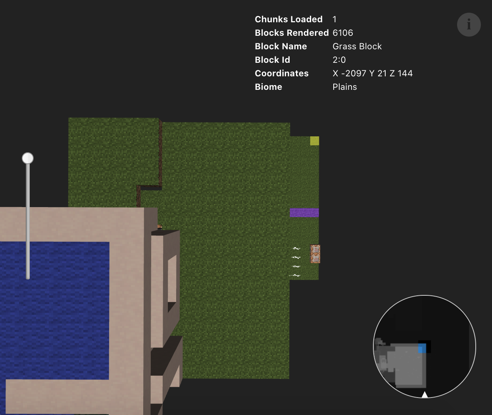
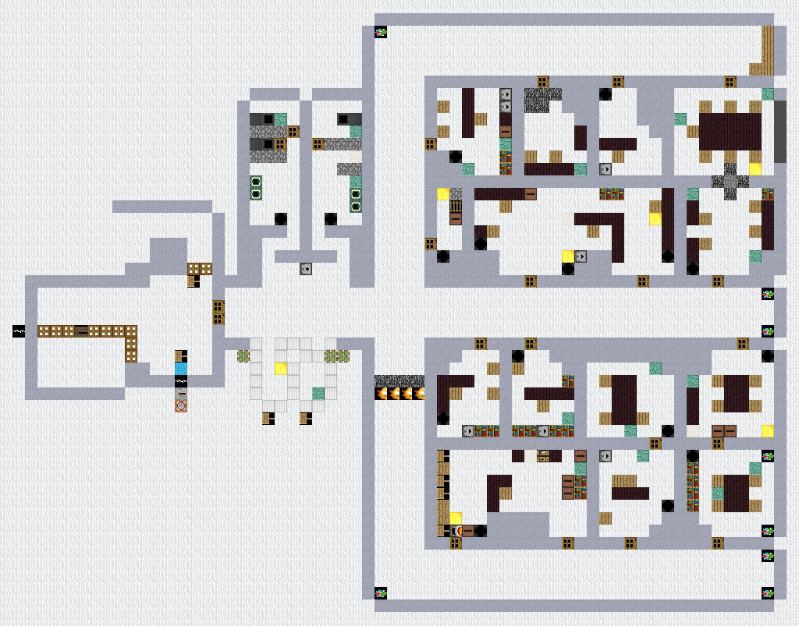
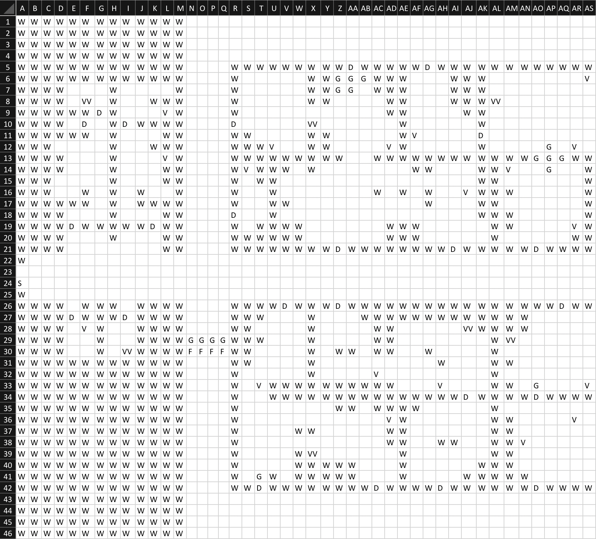
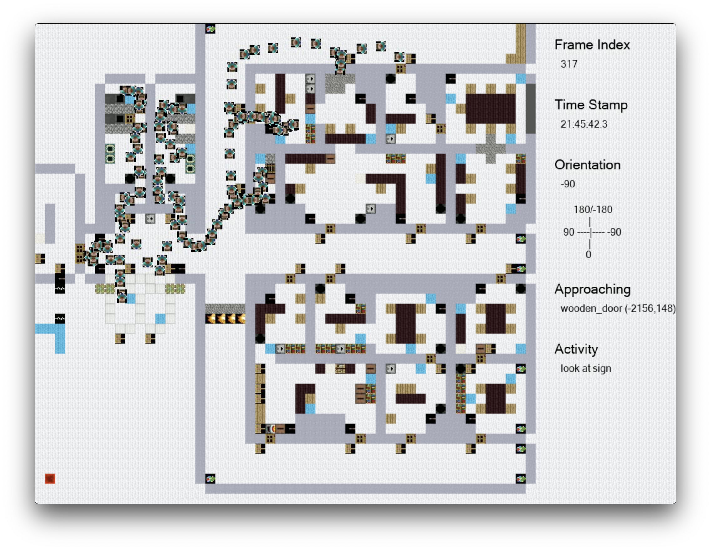
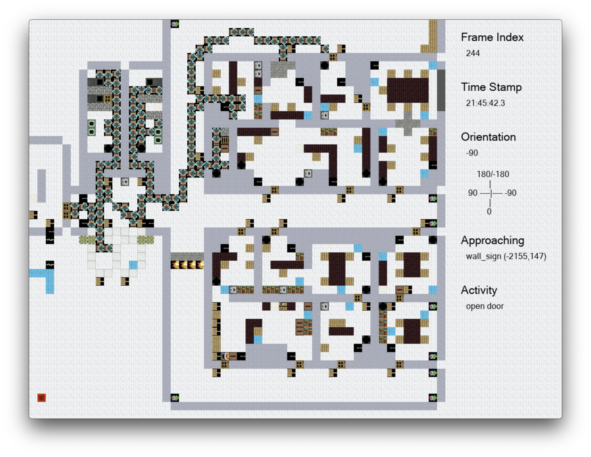

# ASIST-MC-toolbox

Tools for extracting block types from Minecraft world folder and for generating videos of player trajectories. They can be used by running segments in `run_map_generator.ipynb` 

This repository includes the following components:

* `run_map_generator.ipynb` is the place to run the tools
* `map_generator.py` defines the functions used by `run_map_generator.ipynb` for extracting maps
* `trace_generator.py` defines the functions used by `run_map_generator.ipynb` for visualizing testbed messages as videos
* `resources/` stores the texture and distionaries used to generate the maps
* `inputs/` 
  * `worlds/` includes the the Minecraft world folder to be extracted from
  * `trajectories/` includes the the testbed messages file to visualize
* `outputs/` stores the output maps
* `outputs_trajectories/` stores the output videos of visualized trajectories
* `MCWorldLib.egg` is a package we use for extracting region files ([source in Github](https://github.com/MestreLion/mcworldlib))

---

## Required Python Libraries

This tool depends on the following python libraries, which can be installed using your python package manager such as pip or conda.

```python
notebook ## for using the tools in jupyter notebook
Pillow, imageio ## for generating map, visualizing trajectory
json, csv ## for writing and reading JDON and CSV formet
cv2 ## for generating videos
pprint ## for pretty print dictionary structure in debugging
numpy ## for converting angle to radian
tqdm ## for displaying a progress bar when running loops
ffmpeg ## for compressing mp4 of visualized trajectories from 66MB to 5 MB
```

---

## Tool A - Extract map as PNG, CSV, and JSON

We have a tool for extracting the 2D floor plan of structures built in Minecraft and for visualizing human trajectory data on the map as a mp4 file.


The input to map_generator.py include two parts:

* Minecraft world folder that's located in your Malmo folder `MalmoPlatform/Minecraft/run/saves/` (using Malmo) or `/Users/USER_NAME/Library/Application\ Support/minecraft/saves/` (using licenced Minecraft Java Version).

```
world = mc.load('Singleplayer')
region = world.regions[-5,0]
```

Inside the `Singleplayer/region` folder, there are `.mca` files. Each `.mca` file specifies 32 x 32 chunks. Each chunk specifies 16 x 16 x 16 blocks. In the above example, we located an SAR building in `r.-5.0.mca`, which we found using online tool [Chunk viewer](https://pessimistress.github.io/minecraft/) (as shown in the image below). On the interface, adjust the bar on the left to the highest, click the minimap on the bottom right side, and navigate to the light-colored areas representing artificial structures. After we found the .mca file, we need to further narrow down the blocks.



* the second part of the input is the ranges of x,y,z that specify the region of interests. This can be found by locating the building in the .mca file, then record down the coordinates of the top right and bottom left corner block on the ground (as the yellow/blue block shown in the image above). Then record down the lowest and highest level as y values.

```
x_low = -2176  # x of the bottom left block
x_high = -2097  # x of the top right block
z_low = 144     # z of the top right block
z_high = 207  # z of the bottom left block
y_low = 52
y_high = 54
```

The outputs include three parts:

* images of the 2D floor plans on different levels of the region of interest at `outputs/*_map.png` where * = 0,1,2,9


* a json file specifying the block type of all blocks within the region of interest at `outputs/blocks_in_building.json`
```
# key = "x,y,z", value = block_type
"-2152,52,160": "air",
"-2151,52,160": "stained_hardened_clay",
"-2150,52,160": "anvil", ...
```
* a csv file that represent the region of interest that can be used as input to our gridworld framework at `world-builder/outputs/darpa_maze.csv`


## Tool B - Visualize human trajectories as MP4

The input includes DARPA testbed messages in the following formats:

### `.json` files generated by testbed

```
{ "msg":{"source":"simulator","trial_id":"3749faec-574b-4f6e-b198-dbd846b33702","version":"0.5","sub_type":"state","experiment_id":"8f95252a-fb55-470b-8c85-1369abc7c179","timestamp":"2020-06-12T18:49:26.221Z"},"host":"8d73173d6f23","topic":"observations/state","message":"{\"header\":{\"timestamp\":\"2020-06-12T18:49:26.221Z\",\"message_type\":\"observation\",\"version\":\"0.5\"},\"msg\":{\"experiment_id\":\"8f95252a-fb55-470b-8c85-1369abc7c179\",\"trial_id\":\"3749faec-574b-4f6e-b198-dbd846b33702\",\"timestamp\":\"2020-06-12T18:49:26.221Z\",\"source\":\"simulator\",\"sub_type\":\"state\",\"version\":\"0.5\"},\"data\":{\"observation_number\":67,\"timestamp\":\"2020-06-12T18:49:26.221Z\",\"name\":\"K_Fuse\",\"world_time\":10000,\"total_time\":2555616,\"entity_type\":\"human\",\"yaw\":269.25006,\"x\":-2184.962933923586,\"y\":52.0,\"z\":177.52430937017908,\"pitch\":3.149999,\"id\":\"711847e5-1127-317e-bfc7-af0220456927\",\"motion_x\":0.0,\"motion_y\":0.0,\"motion_z\":0.013379795438027031,\"life\":20.0}}","@version":"1","@timestamp":"2020-06-12T18:49:26.225Z","data":{"y":52,"observation_number":67,"id":"711847e5-1127-317e-bfc7-af0220456927","z":177.52430937017908,"motion_z":0.013379795438027031,"name":"K_Fuse","total_time":2555616,"motion_y":0,"x":-2184.962933923586,"entity_type":"human","motion_x":0,"pitch":3.149999,"world_time":10000,"yaw":269.25006,"life":20,"timestamp":"2020-06-12T18:49:26.221Z"},"header":{"version":"0.5","message_type":"observation","timestamp":"2020-06-12T18:49:26.221Z"}}
```

### `.log` files generated by RITA components

```
raw-data 1.58507E+12 {
  app-id:"TestbedBusInterface",
  mission-id:"6483fec4-153c-4994-8f42-a2e9b00d4db3",
  routing-key:"testbed-message",
  testbed-message:{
    msg:{
      trial_id:"6483fec4-153c-4994-8f42-a2e9b00d4db3",
      sub_type:"state", source:"simulator",
      timestamp:"2020-03-24T16:07:18.140779Z"
    },
    data:{
      name:"Player396", entity_type:"human", life:20.0,
      x:-2193.5, y:23.0, z:194.6328125,
      pitch:0.0, yaw:0.0,
      motion_x:0.0, motion_y:0.0, motion_z:0.11038550616085588
    }
  },
  timestamp:1585066038141
}
```

The input also includes the `9_map.png` file that correponds to the data. We need to put it inside `outputs` folder or it may be generated by Tool A.

The codes visualize the location of the player on the map and may infer the object that the player is interacting with. 



The output mp4 file will be generated inside the subfolders of `output_trajectories` that have the same names as those of the messages data files inside `inputs/trajectories`. For example, we make a subfolder named `Hackathon/` in both `input/trajectories/` and `output_trajectory/`. We put the testbed message json files inside `input/trajectories/Hackathon/`, the mp4 files will be generated in `output_trajectory/Hackathon/`

Then we can use ffmpeg inside `output_trajectory/Hackathon/` to compress the mp4 from 66MB to 5 MB in commandlin:e

```
ffmpeg -i input.mp4 -vcodec libx264 -crf 20 output.mp4
```


<!-- The codes may further discretize the continuous position changes to generate a step by step trajectory that can be used as input to the inverse planning framework.  -->